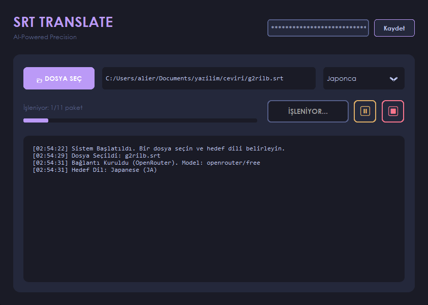

<div align="center">
  

  # 🎬 AI Subtitle Translator (SRT TRANSLATE) v4.0

  [](https://www.python.org/)
  [](https://github.com/TomSchimansky/CustomTkinter)
  [](https://openrouter.ai/)
  [](LICENSE)

  *Modern, estetik ve kesintisiz altyazı çeviri deneyimi.*
</div>

---

### 🎓 Proje Hakkında

Bu proje, **İskenderun Teknik Üniversitesi Bilgisayar Mühendisliği Bölümü - Mühendislikte Bilgisayar Uygulamaları I Dersi** kapsamında proje ödevi olarak geliştirilmiştir.

Geleneksel ve karmaşık altyazı çeviri programlarının aksine, **Tokyo Night** temalı premium arayüzü ve yapay zeka entegrasyonuyla tasarlanmış profesyonel bir `.srt` çeviri aracıdır. Entegre edilen OpenRouter API sayesinde Google Gemini ve diğer güçlü yapay zeka modellerini en verimli şekilde kullanarak bağlamsal çeviriler yapar.

---

## 🌟 Öne Çıkan Özellikler

- 🤖 **Yapay Zeka Destekli (OpenRouter)**: API limitlerine takılmayan altyapı ile bağlamı anlayan, akıllı çeviriler. (Örn: *openrouter/free* ve *gemini-2.5-flash* desteği)
- 🎭 **Akıllı Argo & Yerelleştirme**: "Damn it" gibi deyimleri "Lanet olsun" şeklinde duruma ve akışa en uygun kalıpla çevirir.
- ⏱️ **Kesin Format Koruması**: Zaman kodlarını (timestamps) ve orijinal SRT satır yapılarını ASLA bozmaz.
- 🎨 **Premium Arayüz (Dashboard)**: CustomTkinter ile sıfırdan yaratılmış, derin gece mavisi ve neon aksanlarıyla *Cyberpunk / Tokyo Night* estetiği.
- ⏸️ **Duraklat & Durdur Kontrolü**: Uzun metin çevirilerinde işlemi anında duraklatabilir (Pause) veya durdurup o ana kadar çevirilenleri anında bilgisayarınıza kaydedebilirsiniz (Stop).
- 🌍 **Çoklu Dil Desteği**: İngilizce, Almanca, Fransızca, İspanyolca vb. dillerden Türkçe'ye (veya tam tersi) anında çeviri imkanı.

---

## 🚀 Kurulum & Çalıştırma

**1. Projeyi Bilgisayarınıza İndirin:**
```bash
git clone https://github.com/alierentugrul/SRT-TRANSLATE.git
cd SRT-TRANSLATE
```

**2. Gerekli Kütüphaneleri Kurun:**
```bash
pip install -r requirements.txt
```

**3. Uygulamayı Başlatın:**
```bash
python main.py
```

---

## 🔑 Kullanım Rehberi

1. **API Key Alma**: [OpenRouter.ai](https://openrouter.ai/) adresinden ücretsiz bir hesap oluşturup API Key alın.
2. **Ayarları Kaydetme**: Uygulamayı açtığınızda sağ üstteki **Gemini/OpenRouter API Key...** kutucuğuna anahtarınızı yapıştırıp "Kaydet"e basın.
3. **Çeviri İşlemi**: 
   - `📂 DOSYA SEÇ` butonu ile çevrilecek `.srt` dosyanızı belirleyin.
   - Hedef dili seçin.
   - **ÇEVİRİYİ BAŞLAT** butonuna tıklayın.
4. **Kontrol Sizde**: İşlem sırasında **⏸ (Duraklat)** veya **⏹ (Durdur)** butonlarıyla sürece müdahale edebilirsiniz! İşlem bittiğinde yeni altyazınız orijinal dosyanın bulunduğu klasöre otomatik olarak kaydedilecektir.

---

## 🛠️ Kullanılan Teknolojiler

- **[Python 3.10+](https://www.python.org/)** - Temel dil.
- **[CustomTkinter](https://github.com/TomSchimansky/CustomTkinter)** - Modern, donanım hızlandırmalı GUI framework.
- **[OpenRouter API (urllib)](https://openrouter.ai/)** - Ücretsiz, engelsiz ve çoklu yapay zeka model entegrasyonu.
- **Threading** - Eşzamanlı asenkron arka plan işlemleri sayesinde kasmayan arayüz deneyimi.

---
<div align="center">
  <b>Geliştirici:</b> <a href="https://github.com/alierentugrul">Ali Eren Tuğrul</a>
</div>
